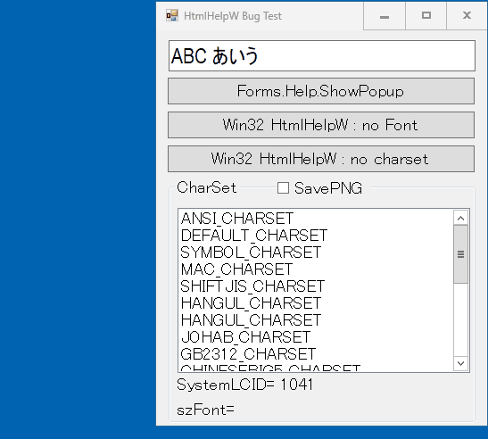
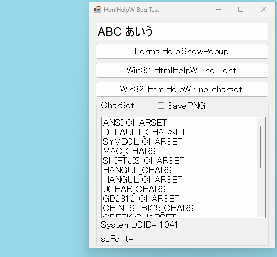
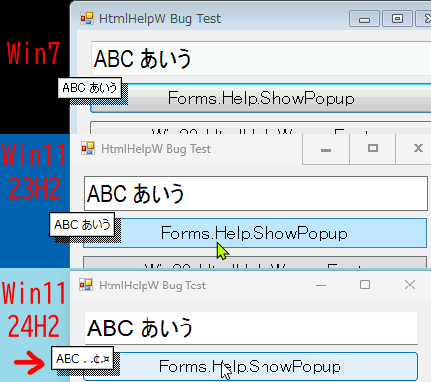

# Win11 24H2 [HtmlHelp](https://learn.microsoft.com/en-us/windows/win32/api/htmlhelp/nf-htmlhelp-htmlhelpw?WT.mc_id=DT-MVP-5000708) Bug

## 現象

Windows 11 24H2で、.Net7以前でビルドされたWindows FormでSystem.Windows.Forms.Help.ShowPopupを読み出すと、Unicode文字列が正しく描画されない。

[.Net8でこの現象とは別の理由で変更されたらしい](https://github.com/dotnet/winforms/pull/8372)


## 発生条件
- Windows 11 24H2
- HH_POPUPのpszTextにANSI_CHARSETで表現できない文字列を設定
- HH_POPUPのpszFontを未指定もしくはpszFontに渡す文字列内のcharsetを未指定
- Win32APIのHtmlHelpをHH_DISPLAY_TEXT_POPUPで実行


```cpp
HH_POPUP popup;
popup = sizeof(HH_POPUP);
popup.idString = 0;
popup.pszText = L"ABC あいう";
popup.pszFont = 0; //NG  // Font not set
...
HtmlHelp(hwnd, null, HH_DISPLAY_TEXT_POPUP, &popup);
```

```cpp
HH_POPUP popup;
popup = sizeof(HH_POPUP);
popup.idString = 0;
popup.idString = 0
popup.pszText = L"ABC あいう";
popup.pszFont = L"MS UI Gothic, 14 , , "; //NG   //CharSet not set
...
HtmlHelp(hwnd, null, HH_DISPLAY_TEXT_POPUP, &popup);
```

```cpp
HH_POPUP popup;
popup = sizeof(HH_POPUP);
popup.idString = 0;
popup.idString = 0
popup.pszText = L"ABC あいう";
popup.pszFont = L"MS UI Gothic, 14 , 0, "; //OK  //ANSI_CHARSET(0)
...
HtmlHelp(hwnd, null, HH_DISPLAY_TEXT_POPUP, &popup);
```

```cpp
HH_POPUP popup;
popup = sizeof(HH_POPUP);
popup.idString = 0;
popup.idString = 0
popup.pszText = L"ABC あいう";
popup.pszFont = L"MS UI Gothic, 14 , 1, "; //OK  //DEFAULT_CHARSET(1)
...
HtmlHelp(hwnd, null, HH_DISPLAY_TEXT_POPUP, &popup);
```

## バグの結果


- Win11 23H2  OK  
  
- Win11 24H2  NG  


- Win7 / Win11 23H2 / Win11 24H2  


## 推測

pszFontによってcharsetが指定されなかった場合、以前はシステムロケールを使用するDEFAULT_CHARSETで処理されていた。
しかし24H2はANSI_CHARSETで処理してしまっている。

つまりpszTextに渡された文字列をシステムロケールの文字列のバイナリに変換し、そのバイナリをANSI_CHARSETとみなして描画しているために正しくない文字が描画されている。


## 暫定的な回避方法

HtmlHelpにはpszFontにcharsetを指定した文字列を設定して実行する。

しかし.Net7以前のWindowsFormのSystem.Windows.Forms.Help.ShowPopupでは指定する方法がない。


---

[HtmlHelpW](https://learn.microsoft.com/windows/win32/api/htmlhelp/nf-htmlhelp-htmlhelpw?WT.mc_id=DT-MVP-5000708)  
[HH_DISPLAY_TEXT_POPUP](https://learn.microsoft.com/previous-versions/windows/desktop/htmlhelp/hh-display-text-popup-command?WT.mc_id=DT-MVP-50007089)  
[HH_POPUP](https://learn.microsoft.com/windows/win32/api/htmlhelp/ns-htmlhelp-hh_popup?WT.mc_id=DT-MVP-5000708)  
[GDI charset](https://learn.microsoft.com/openspecs/windows_protocols/ms-wmf/0d0b32ac-a836-4bd2-a112-b6000a1b4fc9?WT.mc_id=DT-MVP-5000708)  
